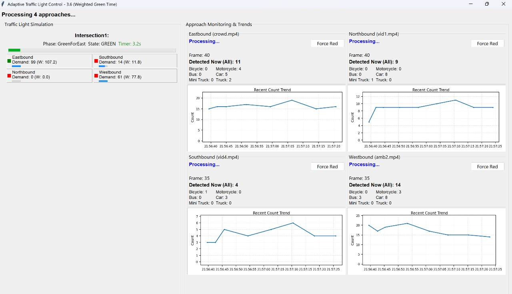
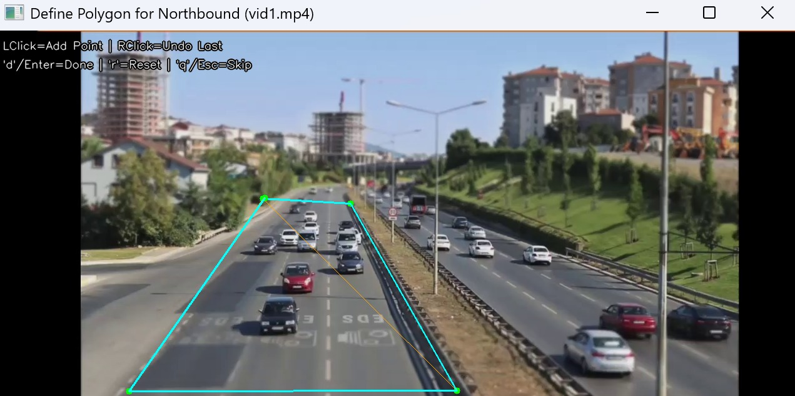

#  Smart AI-Based Adaptive Traffic Signal Control System

An intelligent, real-time traffic signal management system that uses deep learning (YOLOE), dynamic GUI visualization, and ESP32-based hardware control to optimize urban intersections — with emergency vehicle prioritization.


##  Overview

This project is designed to enhance urban mobility through adaptive signal control based on live vehicle detection. It integrates:

-  **YOLOE-11M-Seg model** for real-time vehicle detection
-  **Tkinter GUI** for dynamic traffic visualization and control
-  **ESP32 integration** for hardware traffic light simulation
-  **Ambulance detection and override** for emergency prioritization

 This is an **ongoing project**, with planned enhancements for congestion prediction and expanded vehicle classes.


##  Key Features

- **Vehicle Detection (YOLOE-11M)** – Real-time detection using a lightweight segmentation model.
- **Adaptive Signal Logic** – Traffic light durations are adjusted based on lane-wise demand.
- **Emergency Handling** – Detects ambulances and overrides signal states as needed.
- **Live GUI** – Displays frame count, per-class vehicle counts, status updates, ambulance alerts, and real-time plots.
- **ESP32 Hardware Communication** – Sends compact signal state commands over serial.


##  Technologies Used

- Python 3.8+
- PyTorch & OpenCV
- YOLOE (Ultralytics Fork)
- Tkinter (GUI)
- Matplotlib (Trend Plots)
- pyserial (ESP32 communication)


##  Getting Started

1. **Clone the Repository**

   ```bash
   git clone https://github.com/your-username/smart-traffic-control.git
   cd smart-traffic-control

2. **Install Dependencies**

   ```bash
   pip install -r requirements.txt

3. **Place YOLOE Model**

    - Ensure yoloe-11m-seg.pt is in the project directory.

4. **Run the System**

   ```bash
   python main.py


##  ESP32 Integration

- ESP32 listens via serial at 9600 baud.
- Commands sent as: N:G,E:R,S:Y,W:R (e.g., N = North, G = Green).
- Flash the esp32_traffic.ino sketch to simulate lights with LEDs.

##  GUI Output (Sample Screenshot)



##  Polygon Selection Interface



##  Included Files

| File                  | Description                              |
| --------------------- | ---------------------------------------- |
| `main.py`             | Entry point to run the system            |
| `gui.py`              | GUI logic and live updates               |
| `esp32_controller.py` | Serial communication with ESP32          |
| `config.py`           | Configuration parameters                 |
| `yoloe-11m-seg.pt`    | YOLOE segmentation model                 |
| `esp32_traffic.ino`   | Arduino code for ESP32 signal simulation |
| `requirements.txt`    | Python dependencies                      |
| `README.md`           | Project documentation                    |

All files are located in the root folder.


##  Future Enhancements

- Graph Neural Networks for congestion forecasting
- Auto-rickshaw and special vehicle detection
- Streamlit-based web dashboard
- API for smart city traffic integration
- Cloud-based traffic analytics


##  Team
Rakksitha R, Harish Madhavan V, Nishanth P, Madhu Mita J D


##  License
MIT License – Free to use with attribution.


##  Disclaimer
This is a prototype developed for research and educational purposes.

---
